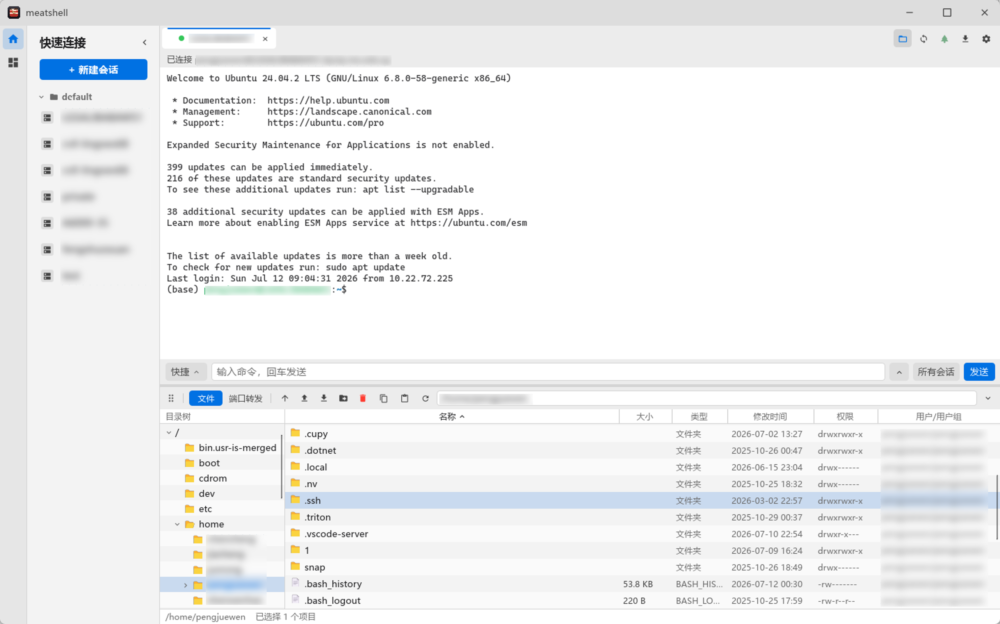
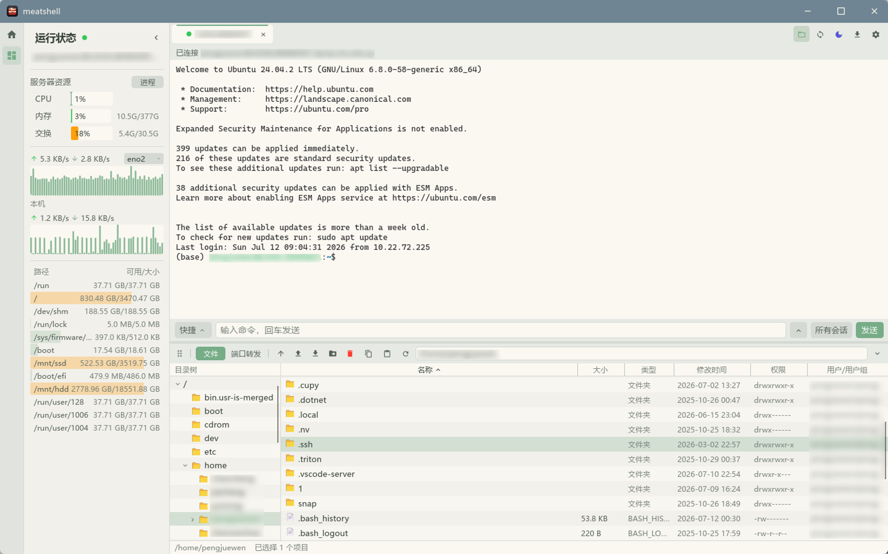
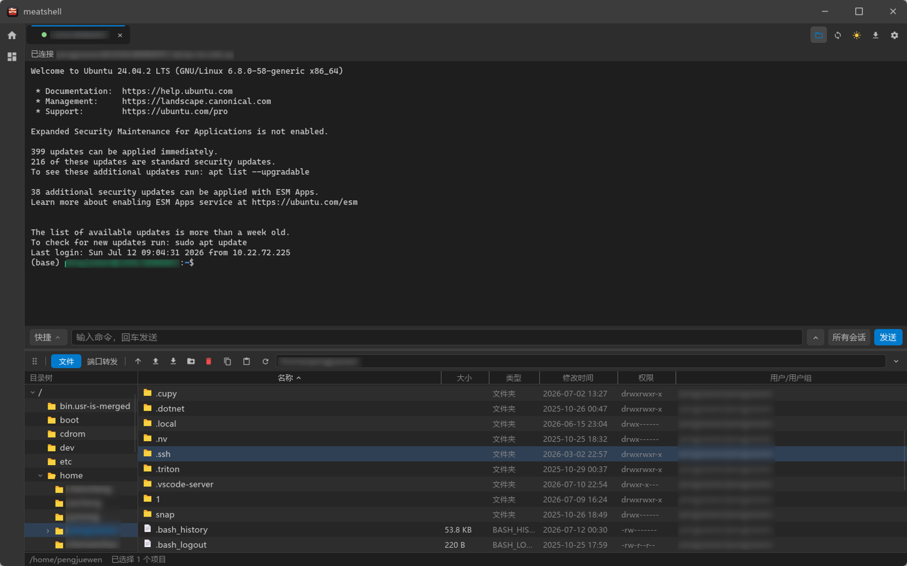

# meatshell-custom

[简体中文](./README.md) | **English**

A lightweight, low-memory SSH / terminal client inspired by FinalShell, but
written entirely in **Rust + [Slint](https://slint.dev)**. The goal is to keep
FinalShell's core experience (resource-monitor sidebar, session management,
tabbed terminals) while cutting memory use from the 400 MB+ of a JVM app down to
the tens-of-MB range of a native binary.

## Custom Version Notes

This branch is based on the original meatshell project with a few custom changes, including feature enhancements, interaction improvements, and bug fixes. The rest of this README is kept as close to the upstream version as possible.

### Changes and Improvements

- SSH connections support X11 forwarding.
- Added a terminal `Ctrl+C` copy preference, allowing users to choose between copy and interrupt behavior.
- Session entries can be reordered by drag and drop within the same group.
- The Quick Connect and Resource Status panels can dock to the left, right, top, or bottom; when both panels are expanded on the same edge, their edge icons are shown side by side so either panel can be switched to or collapsed at any time.
- SFTP supports moving files / folders from the context menu or toolbar, with a visual target-directory picker; multiple selected files / folders can be moved in one batch.
- The SFTP directory tree supports context menus, resizable width, and `Load all` for large directories; the move dialog can automatically locate the current path.
- The SFTP file list supports Windows-style multi-selection with `Ctrl`, `Shift`, and `Ctrl+A`, and shows the selected item count in the status bar.
- The SFTP context menu separates `Download` and `Archive download`, and supports batch download / move / delete for multiple selected files or folders.
- Large SFTP directories use paged initial display plus `Load all`; the file list, directory tree, and move-dialog tree all use virtualized lists to reduce the cost of opening and scrolling huge folders.
- Expanding or collapsing directories in the SFTP move dialog is independent from the main directory tree, so choosing a target directory does not change the main panel's tree state.
- SFTP directory listings are cached within the session, keeping up to 64 recently visited directories; refreshes and file operations update the cache.
- Temporary downloads for SFTP preview / external editing can be cancelled; successful transfers automatically close the download window and clear completed records.
- New / edit session dialogs and SFTP dialogs can be closed quickly with `Esc`; move, rename, permission, and related dialogs can be repositioned by dragging.
- Improved the default focus and cursor position in the SFTP rename dialog.
- Improved cursor-follow behavior for path, rename, move, new-session, and related text fields; when content exceeds the input width, the visible range scrolls to the cursor, and long paths show their ending by default.
- Fixed the startup behavior of the default-collapse setting to avoid conflicts with the saved panel state.
- Improved SFTP file-list refresh behavior to reduce unexpected scroll-position changes.
- Improved SFTP path synchronization when following `cd` inside tmux, with a quick toggle in the top toolbar.
- SFTP toolbar buttons now show hover tooltips for clearer button meaning.
- Added English / Chinese switching for custom SFTP UI text.
- The SFTP file list now has sortable column headers for name, size, type, modified time, permissions, and user/group, while keeping folders and files grouped separately.
- SFTP file types now use a file-manager-style display, recognizing common source, config, log, image, audio, video, archive, executable, and dotfiles, with English / Chinese switching.
- SFTP file-list columns can be resized by dragging their headers; when the panel is docked left or right, header labels align left and overflowing headers, rows, and toolbar controls are clipped to the panel boundary.
- Improved SFTP header dragging so columns that reached their minimum width follow the mouse immediately when dragged back, without accumulating out-of-bounds distance.
- When the SFTP panel is collapsed, unavailable path fields and file-operation buttons are hidden while expand / collapse controls remain available.
- SFTP panel drag-to-dock is limited to the drag handle left of the path bar, avoiding accidental drags from file-list or directory-tree whitespace.
- The SFTP panel now has `Files` and `Port Forwarding` tabs. Connected sessions can create runtime local `-L` and dynamic `-D` (SOCKS5) forwards, view starting / running / failed state, stop forwards, and clear failed records.
- SFTP directory-tree refreshes preserve the manually chosen scroll position; navigating to a folder outside the visible range expands and places the selected folder near the upper part of the tree.
- The SFTP content area supports mouse-button back / forward navigation. Each session keeps up to 20 path-only history entries; normal navigation clears forward history, while refresh does not create history.
- During large-directory loading, consecutive queued directory navigation and refresh requests are coalesced so only the latest view request runs after the current operation finishes.

## Screenshots

<p align="center">
  <br>
  <em>Theme 1</em>
</p>

<p align="center">
  <br>
  <em>Theme 2</em>
</p>

<p align="center">
  <br>
  <em>Theme 3</em>
</p>


<!-- <p align="center">
  <br>
  <em>Welcome page: session management + local resource monitor sidebar</em>
</p>

<p align="center">
  <br>
  <em>Tabbed terminal (full-screen btop) + SFTP file browser + remote resource monitoring</em>
</p> -->

## Download & install

Every `v*` tag triggers a GitHub Actions build that produces native binaries for
**Windows / Linux / macOS**, published on the
[Releases](https://github.com/jeff141/meatshell/releases) page.

### Windows

Download `meatshell-*-windows-x86_64.zip`, unzip, and run `meatshell.exe`.

### Linux

```bash
tar -xzf meatshell-*-linux-x86_64.tar.gz
cd meatshell-*-linux-x86_64
./meatshell                                  # run it directly
# Optional: install the app icon + launcher entry (shows the icon in the dock /
# app list — no argument needed, it finds the binary next to the script)
chmod +x install-linux.sh && ./install-linux.sh
```

> Requires glibc ≥ 2.35 (Ubuntu 22.04+ / Debian 12+). On Wayland you may need to
> log out/in once after installing the icon.

Building from source with `cargo run` on Linux Mint / Ubuntu / Debian requires
the Slint/winit/rfd system development packages:

```bash
sudo apt update
sudo apt install -y --no-install-recommends \
  build-essential pkg-config cmake \
  libfontconfig1-dev libfreetype6-dev \
  libxcb1-dev libxcb-render0-dev libxcb-shape0-dev libxcb-xfixes0-dev \
  libxkbcommon-dev libxkbcommon-x11-dev libwayland-dev \
  libgl1-mesa-dev libegl1-mesa-dev libgtk-3-dev \
  libudev-dev
```

### macOS

The download is a `.zip` containing the `meatshell.app` bundle:

```bash
# Unzip (aarch64 = Apple Silicon, x86_64 = Intel)
unzip meatshell-*-macos-*.zip
# Move it to Applications (optional — it also runs in place)
mv meatshell.app /Applications/
# Clear the quarantine flag, otherwise macOS says "meatshell is damaged and can't be opened"
xattr -dr com.apple.quarantine /Applications/meatshell.app
# Open it (or double-click in Finder)
open /Applications/meatshell.app
```

> If you didn't move it to `/Applications`, point both paths above at wherever the `.app` actually is (e.g. `~/Downloads/meatshell.app`).

> To build from source, see [Running](#running) below.

## Features

### Done

- [x] FinalShell-style UI with dark / light / follow-system themes
- [x] Local + remote resource monitoring (CPU / memory / swap / network / disk)
- [x] Remote process monitor (CPU-sorted table with PID copy and permission-aware termination)
- [x] Full VT/ANSI terminal emulation (btop / htop / vim render correctly)
- [x] Color emoji, including skin tones, flags, and ZWJ sequences
- [x] Tabs (welcome page + multiple sessions)
- [x] Session management: create / edit / delete / groups, local JSON, export / import
  - Config location: `%APPDATA%/meatshell/sessions.json` (Windows)
    / `~/.config/meatshell/sessions.json` (Linux)
    / `~/Library/Application Support/meatshell/sessions.json` (macOS)
- [x] SSH (`russh`, pure Rust): password / private key / encrypted key (passphrase)
- [x] SFTP browser + upload / download (drag-and-drop) + in-terminal ZMODEM (`sz`) receive
- [x] SSH port forwarding / tunnels: local -L / remote -R / dynamic -D (SOCKS5)
- [x] Quick commands + command box (broadcast to all sessions) + command history
- [x] Serial / Telnet sessions
- [x] Outbound proxy (SOCKS5 / HTTP)
- [x] Import `~/.ssh/config`
- [x] Session passwords encrypted at rest (ChaCha20-Poly1305)
- [x] Known-hosts (`known_hosts`) verification + first-connect confirmation
- [x] Split panes for tabbed terminals

Color emoji graphics are provided by [Twemoji](https://github.com/jdecked/twemoji)
under [CC BY 4.0](https://creativecommons.org/licenses/by/4.0/). See
[THIRD_PARTY_NOTICES.md](THIRD_PARTY_NOTICES.md) for the full attribution.

### Planned

- [ ] Store session passwords in the OS keychain

## Tech stack

| Module        | Choice                                                            |
| ------------- | ----------------------------------------------------------------- |
| UI            | [Slint](https://slint.dev) (compiled pure Rust, no GC)            |
| Async runtime | [`tokio`](https://tokio.rs)                                       |
| SSH protocol  | [`russh`](https://crates.io/crates/russh) (no libssh dependency)  |
| System metrics| [`sysinfo`](https://crates.io/crates/sysinfo)                     |
| Serialization | `serde` + `serde_json`                                            |
| Logging       | `tracing` + `tracing-subscriber`                                  |

## Running

```bash
cargo run --release
```

On first launch an empty session store is created at
`%APPDATA%/meatshell/sessions.json`. Click **"＋ New Session"** in the top-right
to add your first server.

## Project layout

```
meatshell/
├── Cargo.toml
├── build.rs                 # Slint compiler entry point
├── ui/
│   ├── app.slint            # top-level window
│   ├── theme.slint          # design tokens
│   ├── widgets.slint        # reusable buttons / inputs / sparkline
│   ├── sidebar.slint        # left-hand system monitor panel
│   ├── tabs.slint           # top tab bar
│   ├── welcome.slint        # welcome page / quick connect
│   ├── session_dialog.slint # new / edit session dialog
│   └── terminal_view.slint  # terminal view (v0.1 line-buffered)
└── src/
    ├── main.rs
    ├── app.rs               # UI ↔ backend bridge
    ├── config.rs            # session JSON persistence
    ├── system.rs            # CPU / memory / network sampling
    └── ssh.rs               # SSH session worker
```

## Development notes

- Slint widgets use a strict layout DSL; after editing a `.slint` file,
  `cargo check` is the fastest feedback loop.
- The application event loop is single-threaded (required by Slint); all
  cross-thread UI updates go through `slint::invoke_from_event_loop` callbacks.
- SSH / SFTP share the `known_hosts` verification path: first contact asks for
  trust and remembers the host key, while later key changes prompt again.

## Release

Do not bump `Cargo.toml` by hand and then create a tag. Use the release helper
so the tag points at a commit that already contains the matching Cargo version:

```powershell
.\scripts\release.ps1 v0.6.0 -Push
```

You can also use a custom tag / release name. If the tag cannot be used to
derive the Cargo version, pass `-Version` explicitly:

```powershell
.\scripts\release.ps1 my-build "v0.5.7 custom" -Version 0.5.7-custom.1 -Push
```

The script updates `Cargo.toml` / `Cargo.lock`, runs `cargo check --locked`,
verifies `meatshell --version`, commits `Release v0.6.0`, creates an annotated
tag, and pushes the current branch plus the tag. See
[docs/release.md](docs/release.md) for details.

## License

Dual-licensed under MIT OR Apache-2.0.

## License

MIT OR Apache-2.0 dual license.
